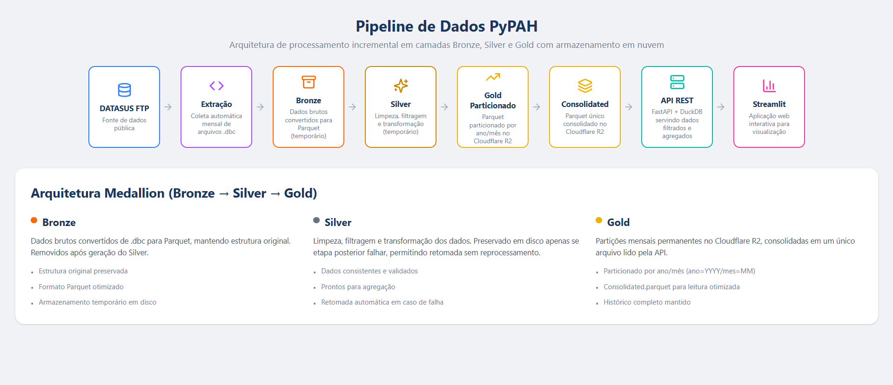

# PyPAH

<p align="center">


</p>

---

Este repositório demonstra como criar um **dashboard utilizando Streamlit na linguagem de programação Python**.

A importância de dashboards está na capacidade de **tornar dados complexos mais claros e acessíveis**, permitindo que:

- cidadãos compreendam melhor informações públicas
- analistas explorem dados com mais facilidade
- gestores tomem decisões mais informadas

No contexto deste projeto, **PyPAH**, utilizamos dados de saúde provenientes do **DATASUS**, banco de dados do **SUS (Sistema Único de Saúde)** do Governo do Brasil.

Mais especificamente, utilizamos dados do **Sistema de Informações Ambulatoriais (SIA)**, focando na **Produção Ambulatorial (PA)** do estado do **Ceará**.

O projeto demonstra uma forma de lidar com dados públicos utilizando Python, realizando todo o processo de:

- **Extração** automática e periódica dos dados do FTP do DATASUS
- **Transformação** com limpeza, filtros e agregações
- **Carga** incremental em armazenamento em nuvem
- **Serviço** dos dados via API REST
- **Visualização** em um dashboard interativo

---

# Arquitetura do Pipeline



O pipeline de dados segue o modelo de arquitetura em camadas utilizado em engenharia de dados, com atualização automática mensal e armazenamento em nuvem:

```text
DATASUS FTP  (dados mensais em .dbc)
     ↓
Extração (Python / PySUS)
     ↓
Bronze (Parquet temporário)
     ↓
Silver (dados tratados — temporário)
     ↓
Gold particionado (Parquet por mês → Cloudflare R2)
     ↓
Consolidated (Parquet único consolidado → Cloudflare R2)
     ↓
API REST (FastAPI + DuckDB)
     ↓
Streamlit Dashboard
```

### Descrição das camadas

**Extração**  
Coleta automática dos dados brutos do FTP público do DATASUS. O pipeline detecta automaticamente quais meses ainda não foram processados e baixa apenas os arquivos novos.

**Bronze**  
Dados brutos convertidos de `.dbc` para Parquet, mantendo a estrutura original. Armazenados temporariamente em disco durante o processamento e removidos em seguida.

**Silver**  
Etapa de limpeza, filtragem e transformação dos dados. Também temporária em disco — preservada apenas se uma etapa posterior falhar, para permitir retomada sem reprocessamento.

**Gold particionado**  
Dados agregados e particionados por ano e mês, armazenados permanentemente no Cloudflare R2 com a estrutura:

```
gold/ano=YYYY/mes=MM/dados.parquet
```

Cada partição corresponde a um mês de dados do Ceará.

**Consolidated**  
Arquivo único `gold/consolidated.parquet` gerado a partir de todas as partições mensais. É o arquivo lido pela API — centraliza todo o histórico em um único Parquet otimizado, evitando que a API precise abrir múltiplos arquivos a cada requisição.

O consolidated é regenerado automaticamente apenas quando há novos meses processados ou quando não existe ainda no bucket.

**API REST**  
Serviço FastAPI que lê o `consolidated.parquet` via DuckDB e expõe endpoints filtrados. Aplica as agregações antes de retornar os dados, reduzindo drasticamente o volume trafegado para o dashboard.

**Streamlit**  
Aplicação web interativa para exploração e visualização dos dados de produção ambulatorial.

---

# Atualização Automática

O pipeline é executado automaticamente uma vez por mês via **Cron Job no Render**. A cada execução:

1. Lista as partições já existentes no R2.
2. Calcula quais meses novos estão disponíveis no FTP do DATASUS (com ~2 meses de defasagem).
3. Processa apenas os meses novos — sem reprocessar o histórico.
4. Faz upload das novas partições para o R2.
5. Regenera o `consolidated.parquet` com todos os dados atualizados.
6. Atualiza as tabelas dimensão (estabelecimentos e procedimentos).

Em caso de falha parcial, o pipeline retoma de onde parou na próxima execução — se o silver de um mês já estiver em disco, pula o download e a conversão e continua a partir da agregação.

---

# Tecnologias Utilizadas

| Tecnologia | Uso |
|---|---|
| Python | Pipeline ETL e API |
| DuckDB | Motor analítico (pipeline e API) |
| Streamlit | Dashboard |
| FastAPI | API REST |
| Docker | Containerização |
| Parquet | Armazenamento colunar |
| PySUS | Acesso aos dados do DATASUS |
| Cloudflare R2 | Armazenamento em nuvem (partições e consolidated) |
| boto3 | Upload para o R2 |
| Render | Deploy da API, dashboard e Cron Job |

---

# Dataset

Os dados utilizados neste projeto são provenientes do **DATASUS**, base pública do Sistema Único de Saúde (SUS) mantida pelo Ministério da Saúde.

Fonte oficial: https://datasus.saude.gov.br/

Especificamente utilizamos dados do:

- Sistema de Informações Ambulatoriais (SIA)
- Produção Ambulatorial (PA)
- Estado do Ceará (CE)

Os dados são disponibilizados mensalmente em formato `.dbc` no FTP público do DATASUS e convertidos para **Parquet** durante o processo de ETL.

---

# Organização das Pastas do Projeto

```text
PyPAH_gmb/
│
├── API/
│   ├── main.py
│   ├── cache.py
│   ├── connection.py
│   └── routers/
│       └── dados.py
│
├── Pipeline/
│   ├── fun_sia.py
│   ├── gold.py
│   └── pipeline_runner.py
│
├── Streamlit/
│   └── dash_PyPAH.py
│
├── docker/
│   ├── Dockerfile.api
│   ├── Dockerfile.dev
│   ├── Dockerfile.pipeline
│   └── Dockerfile.user
│
├── requirements/
│   ├── requirements_api.txt
│   ├── requirements_dev.txt
│   ├── requirements_pipeline.txt
│   └── requirements_user.txt
│
├── docs/
│   ├── arquitetura_PyPAH.png
│   ├── app_com_filtro.png
│   └── app_sem_filtro.png
│
├── .env
├── .dockerignore
├── .gitignore
├── docker-compose.yml
├── LICENSE
└── Readme.md
```

---

# Estrutura de Dados no Cloudflare R2

Todo o armazenamento persistente do projeto vive no bucket do Cloudflare R2:

```text
pypah-gold/
│
├── gold/
│   ├── ano=2018/
│   │   ├── mes=01/dados.parquet
│   │   ├── mes=02/dados.parquet
│   │   └── ...
│   ├── ano=2019/
│   │   └── ...
│   ├── ...
│   └── consolidated.parquet       ← lido pela API
│
└── dims/
    ├── dim_estabelecimento_ce.parquet
    └── dim_procedimento.parquet
```

**Partições mensais (`gold/ano=YYYY/mes=MM/`)**  
Uma partição por mês de dados. Geradas pelo pipeline e usadas para reconstruir o consolidated quando necessário. Nunca sobrescritas após o upload.

**Consolidated (`gold/consolidated.parquet`)**  
União de todas as partições mensais em um único arquivo. Lido pela API a cada requisição. Sobrescrito automaticamente após cada ingestão de novos meses.

**Dimensões (`dims/`)**  
Tabelas de rótulos para estabelecimentos e procedimentos. Atualizadas a cada execução do pipeline.

---

# Módulos do Pipeline

### `fun_sia.py`
Funções de extração e transformação:
- `baixar_dbc` — download dos arquivos `.dbc` do FTP do DATASUS
- `conv_dbc_para_pqt` — conversão de `.dbc` para Parquet (camada Bronze)
- `tratar_dados_sia` — limpeza, filtros e geração da camada Silver
- `estab_ce_label` / `download_proc_label` — download das tabelas dimensão

### `gold.py`
Funções de geração da camada Gold:
- `processar_gold_particionado` — agrega o Silver de um mês e gera o Parquet Gold local
- `consolidar_gold_r2` — lê todas as partições do R2 e gera o `consolidated.parquet` local
- `consolidar_gold_local` — utilitário para consolidar partições locais (desenvolvimento)

### `pipeline_runner.py`
Orquestrador principal. Controla o fluxo completo de uma execução:
- detecta meses novos comparando R2 com FTP
- processa cada mês novo em sequência
- gerencia retomada em caso de falha
- decide se o consolidated precisa ser regenerado
- atualiza as tabelas dimensão

---

# API REST

A API é construída com **FastAPI** e serve o Streamlit. Todos os endpoints leem do Cloudflare R2 via DuckDB.

| Endpoint | Descrição |
|---|---|
| `GET /api/anos` | Anos disponíveis no banco |
| `GET /api/meses` | Meses disponíveis para os anos selecionados |
| `GET /api/municipios` | Municípios disponíveis |
| `GET /api/estabelecimentos` | Tabela dimensão de estabelecimentos |
| `GET /api/procedimentos` | Tabela dimensão de procedimentos |
| `GET /api/dados` | Dados agregados por mês com filtros opcionais |

O endpoint `/dados` aplica os filtros selecionados pelo usuário e retorna os dados já **agregados por `data_ref`** — em vez de retornar milhões de linhas brutas, retorna apenas algumas dezenas de linhas (uma por mês), com os valores somados. As agregações finais para os gráficos são feitas no próprio Streamlit a partir desse retorno enxuto.

---

# Dashboard

### Visualização geral


### Aplicação de filtros


A aplicação permite explorar os dados de produção ambulatorial do Ceará através de filtros interativos por ano, mês, município, estabelecimento e procedimento, com visualizações de valores e quantidades produzidos e aprovados ao longo do tempo.

---

# Variáveis de Ambiente

O projeto utiliza um arquivo `.env` (não versionado) com as seguintes variáveis:

```env
R2_ACCESS_KEY_ID=...
R2_SECRET_ACCESS_KEY=...
R2_ENDPOINT=...
R2_BUCKET=...
API_URL=...
```

As mesmas variáveis devem ser configuradas nos serviços do Render.

---

# Execução Local

## Clonar o repositório

```bash
git clone https://github.com/repositorio-paineis-publicos/PyPAH
cd PyPAH_gmb
```

## Configurar as variáveis de ambiente

Crie o arquivo `.env` na raiz do projeto com as credenciais do R2 e a URL da API.

## Subir os serviços principais

```bash
docker compose up --build -d pypah-api pypah-app
```

| Serviço | Porta |
|---|---|
| pypah-app (Streamlit) | 8501 |
| pypah-api (FastAPI) | 8000 |
| pypah-dev | 8502 |

## Rodar o pipeline manualmente

Para processar apenas meses novos:

```bash
docker compose run --rm --profile pipeline pypah-pipeline
```

Para carga histórica completa:

```bash
docker compose run --rm --profile pipeline pypah-pipeline \
  python -m Pipeline.pipeline_runner --ano-inicio 2018 --mes-inicio 1
```

Para forçar a regeneração do consolidated sem processar meses novos:

```bash
docker compose run --rm --profile pipeline pypah-pipeline \
  python -m Pipeline.pipeline_runner --force-consolidate --skip-dims
```

---

# Deploy no Render

O projeto utiliza três serviços no Render:

| Serviço | Tipo | Dockerfile |
|---|---|---|
| pypah-api | Web Service | `docker/Dockerfile.api` |
| pypah-app | Web Service | `docker/Dockerfile.user` |
| pypah-pipeline | Cron Job | `docker/Dockerfile.pipeline` |

O Cron Job é configurado com o schedule `0 3 10 * *` (todo dia 10 do mês às 3h UTC) e o comando `python -m Pipeline.pipeline_runner`.

---

# Observação

As pastas de dados temporários (`/tmp/pypah/`) são criadas automaticamente durante a execução do pipeline e removidas ao final de cada mês processado. Elas nunca são versionadas no repositório.

---
